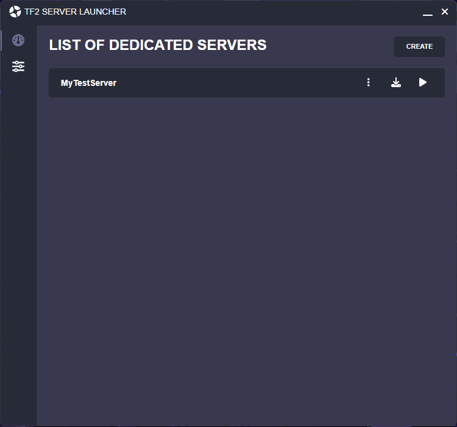

# TF2 Server Launcher

<div align="center">
  
  
  Create, configure, and launch TF2 servers with ease.
</div>

<br>

# Building the project

Make sure these are installed. There is no guarantee that it will work on other versions of Angular, Electron, or Node.

> This project was generated with [Angular CLI](https://github.com/angular/angular-cli) version 15.1.5

> This project uses [Node](https://github.com/nodejs/node) version 19.3.0

> This project uses [Electron](https://www.npmjs.com/package/electron) version 10.0.0

<br>        

### Start by installing the dependencies using npm

```
npm i
```

To work on the interface, use `ng serve` to start the development server. This will not enable the functionalities built with Electron.
```
ng serve
```

To start the project with Electron, use `npm run start`. This compiles the project and starts the Electron app.
```
npm run start
```

# Contributing

1. Fork the Project
2. Create your Feature Branch (`git checkout -b feature/AmazingFeature`)
3. Commit your Changes (`git commit -m 'Add some AmazingFeature'`)
4. Push to the Branch (`git push origin feature/AmazingFeature`)
5. Add yourself to the CONTRIBUTORS.txt file
6. Open a Pull Request

# Usage

### 1- Create and download a server


### 2- Start or stop a server

